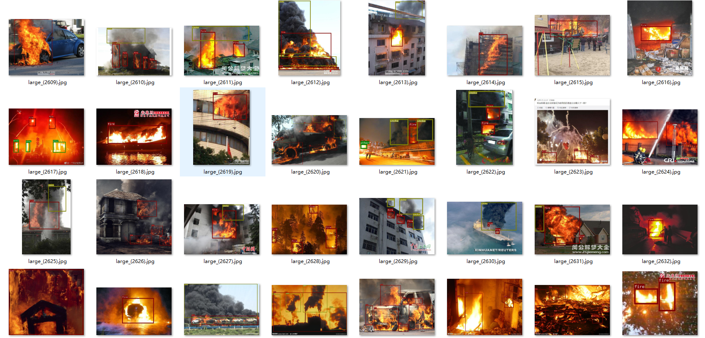

# flames-and-smoke-datasets

## 总结火灾数据集的论文
1. Video Fire Detection Methods Based on Deep Learning: Datasets, Methods, and Future Directions

## 火灾数据集
### 1. DFS
论文： A dataset for fire and smoke object detection \
下载网址：https://github.com/siyuanwu/DFS-FIRE-SMOKE-Dataset?tab=readme-ov-file \
数据集描述：火灾和烟雾检测数据集 (DFS) 包含从真实场景中收集的 9462 张火灾图像。图像根据火焰面积在图像中所占的比例进行分类，包括大火焰、中火焰和小火焰，分别有 3357 张、4722 张和 349 张图像。除了“火焰”和“烟雾”的注释外，DFS 还包含一个名为“其他”的新类别，用于标记车辆灯、路灯、阳光和金属灯等对象，总共包含 1034 张图像。包含此“其他”类别是为了减少因错误分类而导致的误报。\
个人评价：标注的质量不高，且火灾图像的质量也不是很高，DFS中包好大量的其它标注目标"other" 
图片展示(仅展示了火焰和烟雾标注，其余标注请看下载网址或数据集)

### 2. D-Fire dataset
论文：An automatic fire-detection system based on deep convolutional neural networks for low-power, resource-constrained devices \
官方下载网址：https://github.com/gaiasd/DFireDataset \
数据集描述： D-Fire 数据集是专为对象检测方法开发而设计的火灾和烟雾图像集合。考虑到烟雾和火焰的形态多样，该数据集整合了来自互联网、火灾模拟、监控摄像头和人工合成图像的数据，其中人工烟雾使用计算机软件与绿色景观背景合成。D-Fire 数据集包含 21,527 张带 YOLO 格式标签的图像，共计 26,557 个边界框。其中，1164 张图像描绘了火灾，5867 张图像仅描绘了烟雾，4658 张图像描绘了火灾和烟雾，9838 张图像作为反例。\
个人评价：大量重复图像，大量背景图像，且存在火焰和烟雾的背景很黑。 \
图片展示(仅展示了火焰和烟雾标注，其余标注请看数据集)

### 3. FASDD
论文： An open flame and smoke detection dataset for deep learning in remote sensing based fire detection \
下载网址： https://github.com/openrsgis/FASDD?tab=readme-ov-file \
数据集描述：火焰烟雾检测数据集 (FASDD) 是一个包含 100,000 级火焰和烟雾图像的大型数据集，这些图像来自各种来源，包括监控摄像机、无人机、多源遥感卫星图像以及描绘火灾场景的计算机图形绘画。此外，FASDD 数据集包含大量小尺寸火焰和烟雾物体，对小物体检测的深度学习研究提出了挑战。它由两个子集组成：FASDD_CV，包括从监控摄像机、瞭望塔和无人机捕获的 95,314 个样本，以及 FASDD_RS，包括 5773 个遥感图像样本。此外，FASDD 提供了三种不同格式的注释文件。 \
个人评价: \
图片展示(仅展示了火焰和烟雾标注，其余标注请看数据集)

## 双光谱火灾数据集
### 1. Flame 2
论文: FLAME 2: Fire detection and modeLing: Aerial Multi-spectral imagE dataset \
下载网址: https://ieee-dataport.org/open-access/flame-2-fire-detection-and-modeling-aerial-multi-spectral-image-dataset \
个人评价: 大量重复的图像、没有目标检测标注文件 
